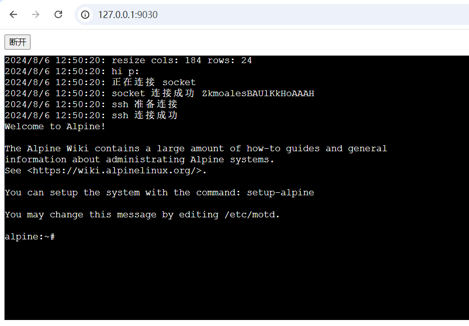

# webssh

> 采用 `fastify` `xterm.js` `socket.io` 实现的单文件网页学习版 ssh

# 使用

```bash
cp .env.example .env
pnpm install
pnpm run dev
```

打开 `http://127.0.0.1:9030/` 点击 `连接`按钮 即可看到效果



# 相关地址

- https://github.com/mscdex/ssh2
- https://github.com/socketio/socket.io
- https://github.com/xtermjs/xterm.js
